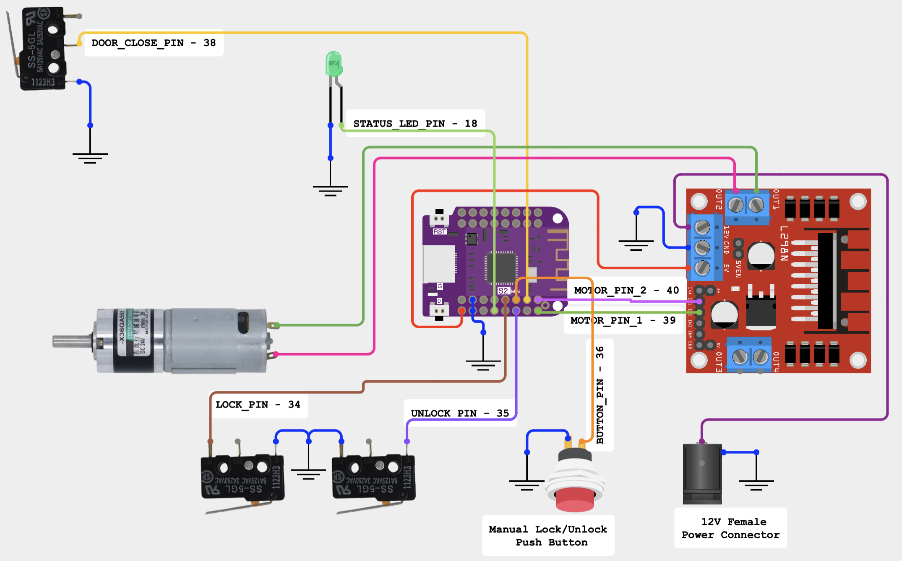

# ESP32 HomeKit Door Lock

This project enables an ESP32-based door lock system that integrates with Apple's HomeKit, allowing users to control the lock using the Apple Home app and Siri voice commands.

## Features

- **HomeKit Integration**: Control the lock via the Apple Home app or Siri.
- **Secure Communication**: Utilizes HomeKit's security protocols for encrypted access.
- **Real-time Status**: Monitor the lock's status (locked/unlocked) within the Home app.
- **Wi-Fi Connectivity**: Connects to your home network for remote access.

## Hardware Requirements

- **ESP32 Development Board**
- **Electronic Door Lock Mechanism**
- **Relay Module** (if required by the lock mechanism)
- **Power Supply** compatible with the ESP32 and lock system

## Software Requirements

- **Arduino IDE**: Development environment for ESP32
- **HomeSpan Library**: Required for HomeKit functionality
- **DebounceEvent Library**: Used for handling button debounce events

## Setup and Installation

1. **Clone the Repository**:
   ```bash
   git clone https://github.com/dabare/esp32-homekit-door-lock.git
   cd esp32-homekit-door-lock
   ```

2. **Install Required Libraries**:
   - Ensure you have Arduino IDE installed and configured.
   - Install HomeSpan and DebounceEvent libraries via the Arduino Library Manager or manually.

3. **Build and Upload the Firmware**:
   - Open the project in Arduino IDE.
   - Select the appropriate ESP32 board in the Board Manager.
   - Compile and upload the firmware to the ESP32.

4. **Wi-Fi Configuration**:
   - Connect the ESP32 to power.
   - Use the provided setup method (e.g., serial or web-based configuration) to connect the ESP32 to your Wi-Fi network.

5. **Pair with HomeKit**:
   - Open the Apple Home app on your iOS device.
   - Add a new accessory and enter the code provided by the ESP32 during setup.

## Usage

- Lock or unlock the door using the Home app.
- Use Siri voice commands to control the lock.
- Automate locking and unlocking based on HomeKit scenes and routines.

## Troubleshooting

- **ESP32 not connecting to Wi-Fi**: Ensure the network credentials are correctly configured.
- **HomeKit pairing issues**: Reset the ESP32 and retry the pairing process.
- **Firmware not uploading**: Verify that the correct board and COM port are selected in Arduino IDE.

## Contributing

Contributions are welcome! Fork the repository and submit a pull request for improvements or bug fixes.

## Circuit Diagram

Refer to the following diagram for wiring connections:



## License

This project is licensed under the MIT License. 

## Demo and Full Guide Video
https://youtu.be/zGCrUGdHpgE

